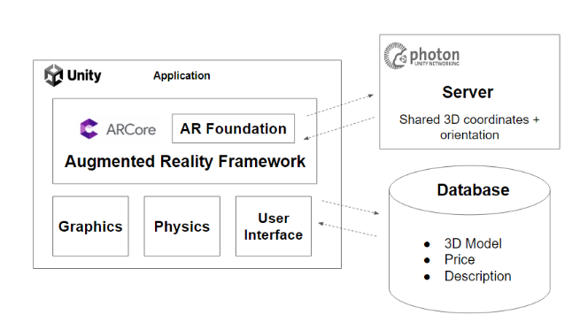
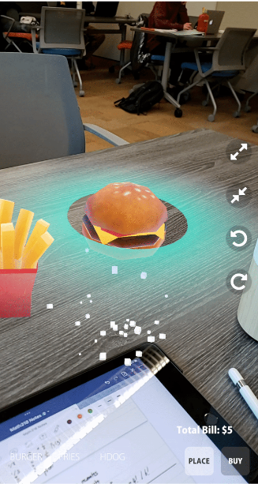

# Augmented Reality Restaurant Menu for Large Groups

  

## Introduction
Ordering food at a restaurant as a large group is a daunting task: It’s not easy for everyone to communicate what they want, or even know what they want if the dishes are unfamiliar to them. With current paper and digital menus that are using only texts to describe the menu, people do not get to see the accurate representations of the dishes. 

The goal of this project is to streamline the process of ordering shared food for large groups of people eating together at a restaurant. Using Augmented Reality (AR) technology and cloud services, our app goes beyond the simple display of menu items by allowing users to visualize and interact with virtual food models in a real-time, dynamically shared environment.

## System Design

  

The main app is built using Unity (which handles the graphics, object physics, and UI layer) while AR Foundation and AR Core provide the AR featureset. To allow for a multiple user experience, we use Photon’s PUN 2 to allow devices to connect to Photon cloud servers to send real-time object data. 

## User Interface

  

The general user flow is as follows.
1. Upon app start, the user is greeted with “Start”, “Credit”, and “Quit” buttons.
2. After pressing “Start”, move the device around until the placement indicator appears on the screen. This means the table surface has been properly detected.
3. The user clicks on “Join Room”, which connects the device to the Photon cloud servers. 
4. Menu items can be selected in the bottom left. The item name and cost will be displayed in the top left. The placement indicator icon will show the location of the object before it’s created.
5. Click “Buy” to create the object and update the total bill at the top across all devices. 
6. Menu items can be subsequently moved by any user. 
